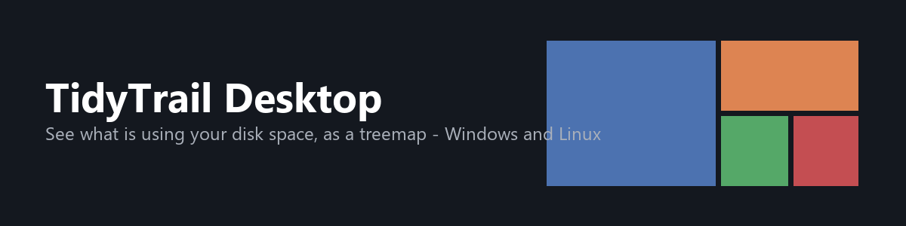

<p align="center">
  
</p>

<p align="center">
  <a href="https://github.com/sunilgentyala/TidyTrail-Desktop/actions/workflows/ci.yml"></a>
  
  
  
  <a href="LICENSE"></a>
  
</p>

TidyTrail Desktop scans a folder or drive and shows what is using space as a
squarified treemap, the same visual approach TreeSize and WinDirStat use:
rectangles sized by file/folder size and colored by file type, so the biggest
thing on disk is also the biggest thing on screen. It is the Windows/Linux
sibling of [TidyTrail](https://github.com/sunilgentyala/TidyTrail), the
iOS/Mac storage organizer, built as a separate native app since Swift/SwiftUI
has no real GUI story on Windows and only a partial one on Linux.

## What it does

| | |
|---|---|
| **Pick a folder or drive** | Windows: every mounted drive letter, listed automatically. Linux: `/`, your home directory, and anything mounted under `/media` or `/mnt`. Or browse to any folder with the native file picker. |
| **See it as a treemap** | A squarified treemap of the current folder's direct children, colored by category (folder, archive, audio, video, image, document, code, executable, system, other). Double-click a folder tile to drill into it; the breadcrumb bar tracks where you are. |
| **Or as a sortable list** | Toggle to a flat, size-sorted list with a percentage bar per item, for when a table is easier to scan than rectangles. |
| **Clean up safely** | Select one or more files/folders and move them to the OS trash or recycle bin, not a hard delete, so a bad click is recoverable. |

Scanning skips symlinks and, on Windows, junctions/mount points, treating
them as zero-size leaves instead of following them. Windows ships several
self-referential junctions (`AppData\Local\Application Data` is one), and
following them turns a scan into unbounded recursion; `core/src/scanner.rs`
has a regression test that reproduces exactly that shape.

## Installing

Grab the latest build from the
[Releases page](https://github.com/sunilgentyala/TidyTrail-Desktop/releases):

| | |
|---|---|
| **Windows, installed** | `.msi` or `.exe` (NSIS) - either runs a normal installer and adds a Start Menu entry. |
| **Windows, portable** | `TidyTrail-Desktop-<version>-portable-windows-x64.zip` - unzip and run `tidytrail-desktop.exe` directly, no install, nothing written outside the folder you unzip it into. Still needs the [WebView2 Runtime](https://developer.microsoft.com/microsoft-edge/webview2/), which ships pre-installed on Windows 11 and current Windows 10. |
| **Linux** | `.deb` to install with your package manager, or `.AppImage` - `chmod +x` and run it directly, no install, same portable idea as the Windows zip. |

### Windows may warn you before it runs

None of the Windows builds are code-signed yet, so Microsoft Defender
SmartScreen will show **"Windows protected your PC"** the first time you run
the installer or the portable exe - this is standard for any unsigned app,
not a sign something's wrong. Click **More info**, then **Run anyway** to
continue. This goes away once the release is either code-signed or has
enough download history for SmartScreen to recognize it.

## Architecture

- **`core/`** (`tidytrail-core`) - the Rust library with the actual logic:
  recursive directory scanning (`scanner.rs`), the squarified treemap layout
  algorithm (`treemap.rs`, Bruls/Huizing/van Wijk 2000), OS-trash-backed
  deletion (`trash.rs`), byte formatting, and file-category classification.
  No GUI dependency, so it's unit- and integration-tested on its own
  (`cargo test -p tidytrail-core`) independent of Tauri or a display.
- **`app/src-tauri/`** - the Tauri 2 application shell: exposes `core` as a
  handful of commands (`scan_path`, `cancel_scan`, `delete_paths`,
  `list_roots`) over Tauri's IPC bridge.
- **`app/ui/`** - the frontend: plain HTML/CSS/JS, no framework or build
  step. The canvas-based treemap re-runs the same squarified algorithm in JS
  (mirroring the tested Rust version, verified to produce identical output)
  so resizing and drilling down stay instant without an IPC round trip per
  frame.
- **`.github/workflows/ci.yml`** - runs `cargo test --workspace` on both
  `windows-latest` and `ubuntu-latest` on every push/PR.
- **`.github/workflows/release.yml`** - on a `v*` tag (or manual dispatch),
  builds installers for both platforms (`.msi`/`.exe` for Windows,
  `.deb`/`.AppImage` for Linux) via
  [`tauri-action`](https://github.com/tauri-apps/tauri-action), zips the raw
  Windows exe as a portable no-install option, and attaches everything to a
  draft GitHub Release.

## Building locally

Requires [Rust](https://rustup.rs) and [Node.js](https://nodejs.org) (Node is
only used to run the Tauri CLI; the frontend itself has no build step).

```bash
cargo test --workspace          # run the core logic tests
npx @tauri-apps/cli dev         # run the app in dev mode
npx @tauri-apps/cli build       # build a release installer for this OS
```

On Linux, building/running also needs the system WebView packages Tauri
depends on (`libwebkit2gtk-4.1-dev`, `libayatana-appindicator3-dev`,
`librsvg2-dev`, `libssl-dev` on Debian/Ubuntu) - see
[`ci.yml`](.github/workflows/ci.yml) for the exact package list.

## Status

In development, pre-release. Core scanning/layout/deletion logic is unit
tested and has been run against real multi-hundred-gigabyte directory trees
(including Windows junction points) without issue. The UI has not yet been
through a full manual QA pass on Linux.

## License

MIT - see [LICENSE](LICENSE).
